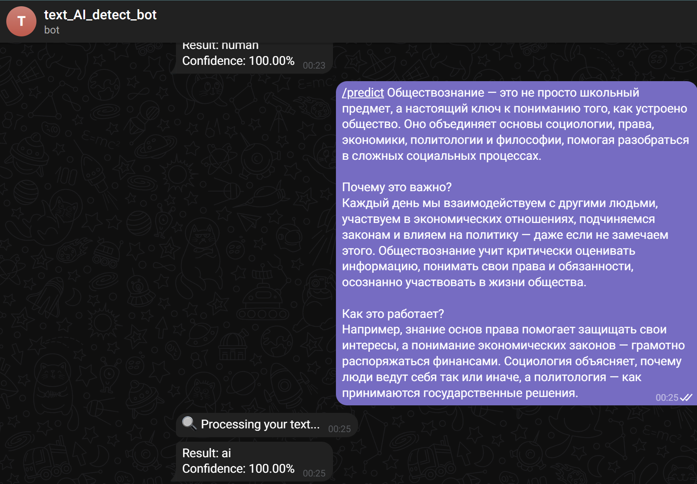

### Аугуст Мария Сергеевна, Лущева Ксения Сергеевна
#### Приложение к магистерской диссертации "Методы идентификации искусственно сгенерированных текстов для обеспечения информационной достоверности"
##### Направление подготовки 01.04.02 Прикладная математика и информатика, образовательная программа «Машинное обучение и высоконагруженные системы» ФКН НИУ ВШЭ

#### Appendix to Master's thesis "Methods for identifying artificially generated texts to ensure information reliability"

#### Аннотация
В данной работе решается задача автоматического определения происхождения текста — человеческого или сгенерированного с помощью нейросетевой модели.
Для проведения эксперимента был собран и размечен датасет, включающий как тексты, написанные людьми, так и тексты, сгенерированные современными языковыми моделями. Исследование проводилось с использованием трёх архитектур: Word2Vec, BERT и ELECTRA. Основное внимание уделялось анализу как семантических, так и стилистических характеристик текста.
Качество классификации оценивалось с помощью метрик Accuracy и F1-score.
По результатам первого этапа обучения выявлены проблемы в структуре данных, что привело к пересборке датасета и повторному эксперименту.
На втором этапе исследования к уже использованным моделям была дополнительно реализована архитектура типа GAN (Generative Adversarial Network), что позволило расширить экспериментальную часть работы.
По итогам двух экспериментов на обновлённом датасете были получены высокие показатели качества, что демонстрирует значимость подбора качественного корпуса для задач текстовой классификации и подтверждает применимость выбранных архитектур к задаче определения происхождения текста.
В завершение проекта был разработан пользовательский сервис, позволяющий определить вероятное авторство текста в реальном времени с помощью Telegram-бота.



#### 🚀 Запуск проекта локально
##### Предварительные требования
1) Установить:
* [Docker](https://docs.docker.com/get-docker/) (версия 20.10+)
* [Docker Compose](https://docs.docker.com/compose/install/) (версия 2.0+)
* [Git](https://git-scm.com/downloads)

2) Создать Telegram-бот (через @BotFather) и сохранить api-token
3) В @BotFather создать для бота команду /predict

##### Установка и запуск
Склонировать проект и создать файл .env:

```
git clone https://github.com/klushcheva/ai_generated_text_detection.git 
cd ai_generated_text_detection
touch .env
```
В файл .env поместить конфигурацию:
```
TELEGRAM_TOKEN=<api_токен_бота>
MODEL_PATH=/app/model
REDIS_HOST=redis
```
Собрать и запустить контейнеры:
`docker-compose up --build`

##### Использование бота
1) Перейти в диалог с ботом, отправить команду /start
2) Отправить команду /predict <текст для классификации>

##### Остановка проекта:
Остановить контейнеры:
`docker-compose down`

##### Важные команды:
 * Пересобрать контейнеры:	`docker-compose up --build`
* Просмотр логов бота	`docker-compose logs -f bot`
* Очистка Redis `docker-compose exec redis redis-cli FLUSHALL`
* Рестарт сервисов `docker-compose restart`
